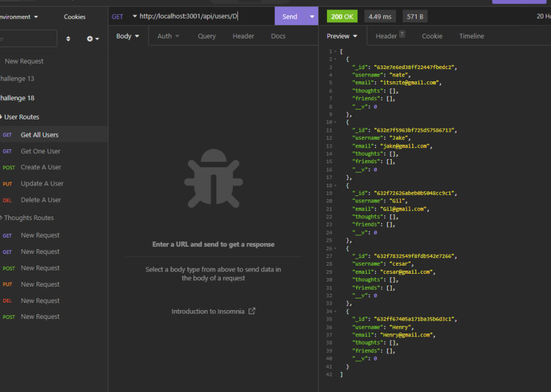
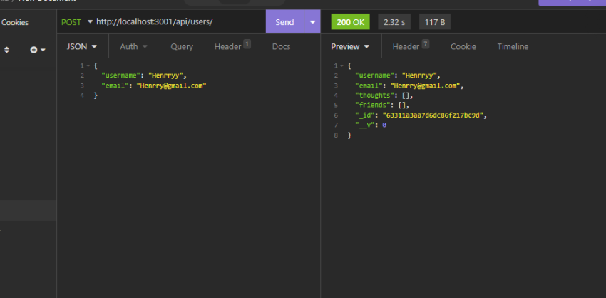
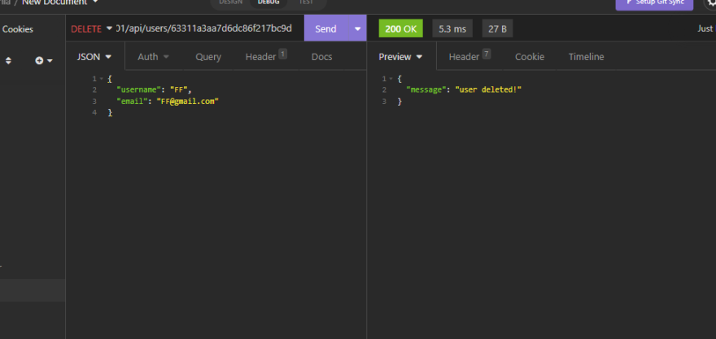
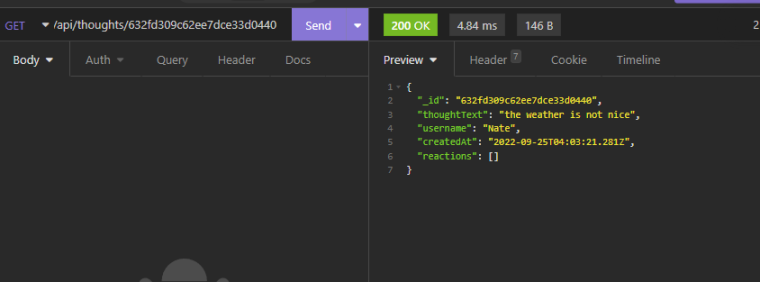
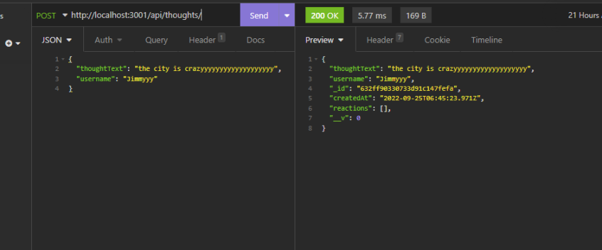
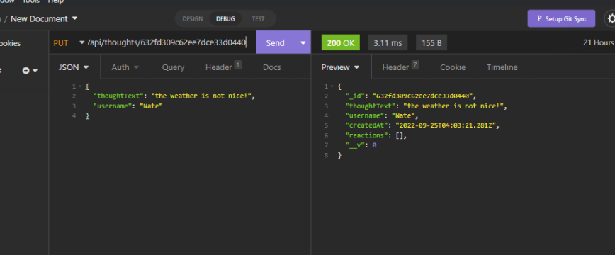
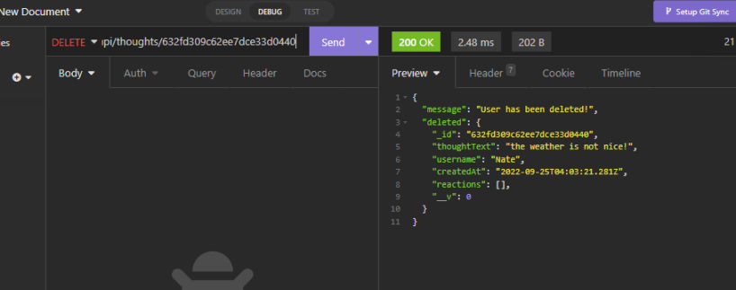

# Social Network API

This challenge is for making API end points for a social network web application. Building calls so users can share their ideas and also react to and add other users as friends.

[MIT](https://choosealicense.com/licenses/mit/)

## Table Of Contents

- [Videos](#videos)
- [Install](#install)
- [Pictures](#pictures)
- [Contribute](#contributing)
- [Questions](#questions)

## Videos

recorded with screencastify

- Startiing app and User API routes demo: https://drive.google.com/file/d/1ELBAyyyR_OXLggMjqzzmo0PoOBYBYe_I/view
- thought API routes demo: https://drive.google.com/file/d/1A2N7cjm7J1uEtdG_ZE-jwkfyCp5qMqtS/view

## Install

Before installing, you must have node.js for the backend and Mongo for the database. Once you have that, you can install the npm packages, (express, and mongoose) in your command line.
After all that, run `npm start` to start the application, or run `npm run watch` if you want to use nodemon.

## Pictures

## Contributing

You can clone or fork, make your own chanages and make a pull request!

## Questions

_Reach Out!_

Github: [TDGNate](https://github.com/TDGNate)

Email: itsnzte@gmail.com
